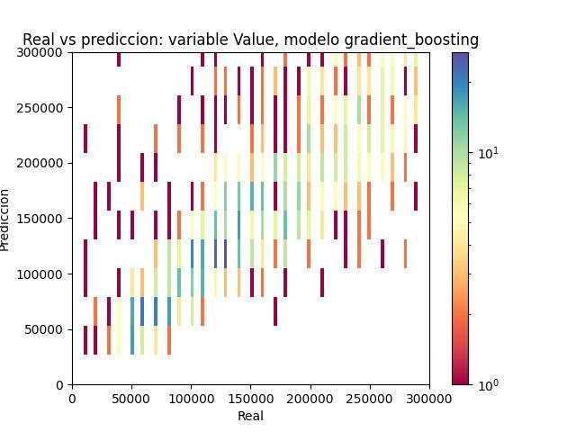
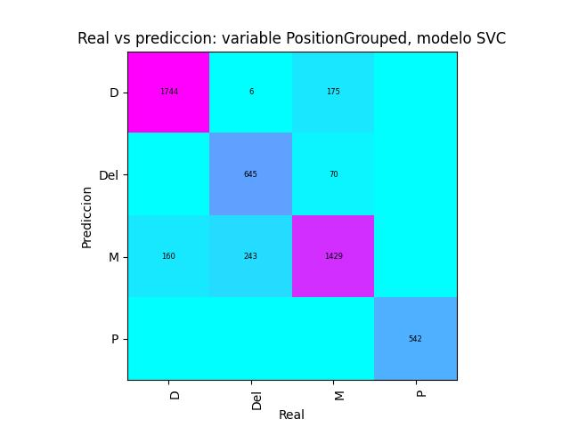
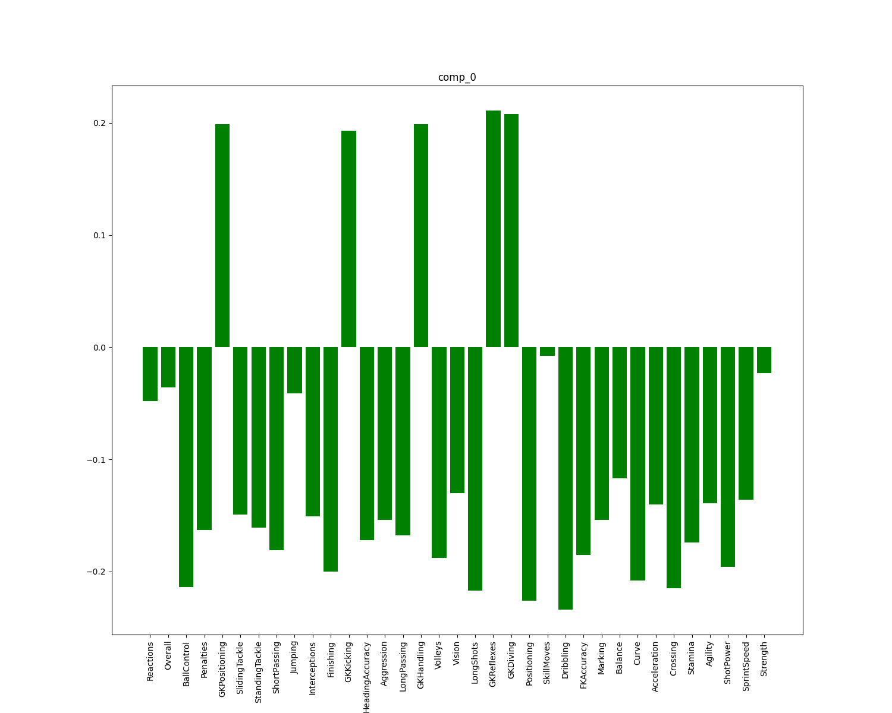
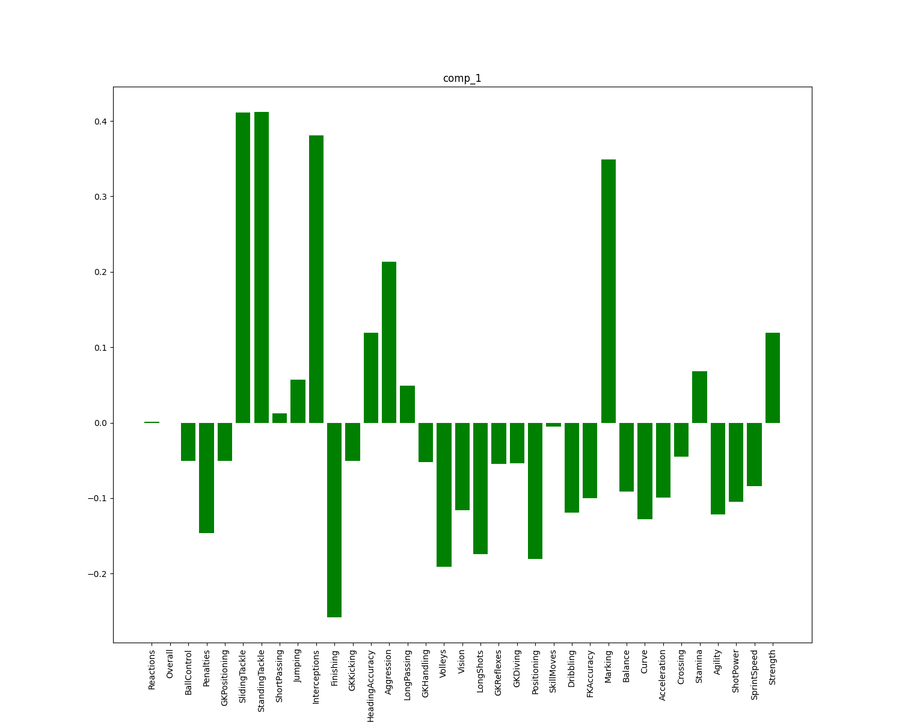
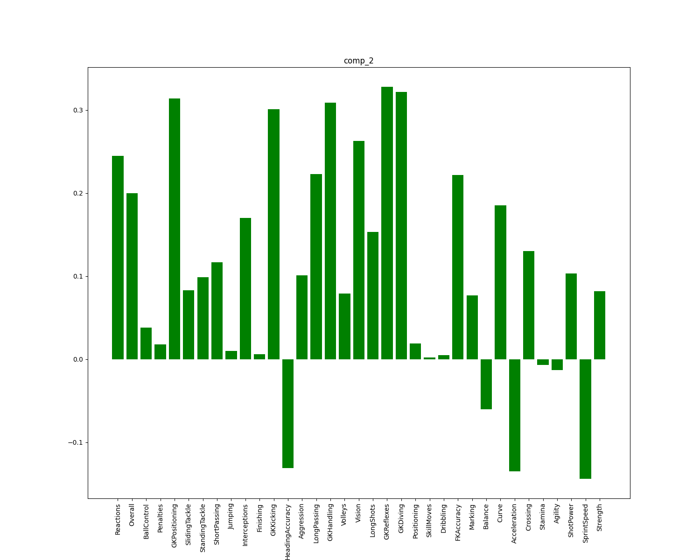

# Machine learning sobre datos del FIFA 19

Comparación de  diferentes modelos de regresión y clasificación para predecir diferentes variables de los jugadores del FIFA 19, y clustring para agruparlos.
## VARIABLES A PREDECIR Y VARIABLES EXPLICATIVAS
Las variables que se quieren predecir son las siguientes:
* **<b>Valor de mercado </b> del jugador (regresión).**
* **Sueldo del jugador (regresión).**
* **Posición del jugador (clasificación).** Dentro de la posición del jugador, se intentó predecir esta sin agrupar y agrupando con varios niveles de agrupación,
puesto que originalmente hay 27 posiciones posibles, algunas con pocos datos.
  * **Posición**. Las posiciones originales del FIFA 19. 
  * **Posición sin lado.** Se elimina la posición izquierda y derecha y  se agrupan en la posición central.
  * **Posición agrupada.** Se agrupan las posiciones en Portero (P), Defensa (D), Medio (M) y Delantero (Del).
  <table>
    <tr><th>Posicion original </th><th>Posicion sin lado</th><th>Posicion agrupada</th></tr>
     <tr><th>GK  (Portero)</th><th>GK</th><th>Portero</th></tr>
     <tr><th>RWB (Carrilero Derecho)</th><th>WB</th><th>Defensa</th></tr>
     <tr><th>LWB (Carrilero Izquierdo)</th><th>WB</th><th>Defensa</th></tr>
     <tr><th>RB (Lateral derecho)</th><th>CB</th><th>Defensa</th></tr>
     <tr><th>LB (Lateral Izquierdo)</th><th>CB</th><th>Defensa</th></tr>
     <tr><th>CB (Defensa Central)</th><th>CB</th><th>Defensa</th></tr>
     <tr><th>RCB (Defensa Central Derecho)</th><th>CB</th><th>Defensa</th></tr>
     <tr><th>LCB (Defensa Central Izquierdo)</th><th>CB</th><th>Defensa</th></tr>
     <tr><th>CDM (Medio Centro Defensivo)</th><th>DM</th><th>Medio</th></tr>
     <tr><th>LDM (Medio Defensivo  Izquierdo)</th><th>DM</th><th>Medio</th></tr>
     <tr><th>RDM (Medio Defensivo  Derecho)</th><th>DM</th><th>Medio</th></tr>
     <tr><th>RM (Medio Derecho)</th><th>M</th><th>Medio</th></tr>
     <tr><th>LM (Medio Izquierdo)</th><th>M</th><th>Medio</th></tr>
     <tr><th>CM (Medio Centro)</th><th>CM</th><th>Medio</th></tr>
     <tr><th>LCM (Medio Centro Izquierdo)</th><th>CM</th><th>Medio</th></tr>
     <tr><th>RCM (Medio Centro Derecho)</th><th>CM</th><th>Medio</th></tr>
     <tr><th>CAM (Medio Centro Ofensivo)</th><th>AM</th><th>Medio</th></tr>
     <tr><th>LAM (Medio Izquierdo Ofensivo )</th><th>AM</th><th>Medio</th></tr>
     <tr><th>RAM (Medio Derecho Ofensivo)</th><th>AM</th><th>Medio</th></tr>
     <tr><th>CF (Media Punta)</th><th>CF</th><th>Delantero</th></tr>
     <tr><th>RF (Segundo Delantero Derecho)</th><th>CF</th><th>Delantero</th></tr>
     <tr><th>LF (Segundo Delantero Izquierdo)</th><th>CF</th><th>Delantero</th></tr>
     <tr><th>RW (Extremo Derecho)</th><th>W</th><th>Delantero</th></tr>
     <tr><th>LW (Extremo Izquierdo)</th><th>W</th><th>Delantero</th></tr>
     <tr><th>ST (Delantero Centro)</th><th>ST</th><th>Delantero</th></tr>
     <tr><th>LS (Delantero  Izquierdo )</th><th>S</th><th>Delantero</th></tr>
     <tr><th>RS (Delantero derecho)</th><th>S</th><th>Delantero</th></tr>
     
</table>

Las variables explicativas disponibles son las características de los jugadores y son las siguientes:
* Reactions
* Overall
* BallControl
* Penalties
* GKPositioning
* SlidingTackle
* StandingTackle
* ShortPassing
* Jumping 
* Interceptions
* InternationalReputation
* Finishing
* GKKicking
* Heading*Accuracy*
* Aggression
* LongPassing
* GKHandling
* Volleys
* Vision
* LongShots
* GKReflexes 
* GKDiving 
* Positioning
* SkillMoves
* Dribbling
* FK*Accuracy*
* Marking
* Balance
* Curve
* Acceleration
* Crossing
* Stamina
* Agility
* ShotPower
* SprintSpeed
* Strength
##

## ESTRUCTURA DEL PROYECTO

En <b>src/index/ </b> están los scripts a ejecutar.
* **train_all**. Se entrenan todos los modelos de regresión (sobre Wage y Value ) y clasificación (sobre Position y PositionGrouped, que es la posicón agrupada).
* **predict**. Se introduce por consola parte de un nombre (jugador o equipo) y una variable a predecir y 
se muestran las predicciones (con el mejor modelo o todos) y el valor real.
* **train_one_model_regression**. Para entrenar un solo modelo de regresión sobre una variable.
* **train_one_model_clasificacion**. Para entrenar un solo modelo de clasificación sobre una variable.
* **plots_results**. Para visualizar las predicciones: predicción vs valor real usando gráficos de dispersión o histogramas 2d.
* **plots_explicativas**  Para visualizar los valores de <b><b>Salario</b></b> y <b><b>Valor de mercado </b></b> frente a las explicativas. De estas visualizaciones podemos pensar que
quizás sea útil utilizar una transformación logarítimica sobre ambas variables para predecirlas.
* **clustering**. Kmeans y dbscan para agrupar a los jugadores.

En <b>reports/</b> están almacenados diferentes reportes:
* **resultados_entrenamiento_cv/**. Se guardan  los resultados de cross validation para todos los modelos en un archivo *json* para cada variable(incluyendo métricas, parámetros opimizados, parámetros fijos que se hayan modificado respecto al valor por defecto,
y transformaciones sobre los datos).
* **resultados_finales/**. Se guarda en un archivo *json* para cada variable  los parámetros seleccionados para cada modelo, incluyendo también métricas, parámetros etc, 

* **plots/**. Se guardan los plots con las predicciones vs datos reales sobre el total de los datos y solo sobre los datos de validación para cada modelo, en las carpetas
 <b> all/ </b> y <b> test/ </b> respectivamente. En ambos directorios tenemos:
  * **classification/**. Gráficos de densidad con texto (con el número de datos para cada bin) para los modelos de clasificación.
  * **classification_sin_texto/**. Gráficos de densidad con escala de color.
  * **regression/**.  En los modelos de regresión se usan gráficos de dispersión.
  * **regresion_sin_valores_altos/**. Gráficos de dispersión eliminando los valores más altos para ver los datos más concetrados en una mejor escala.
  * **regresion_histogramas_2d/**. Histogramas 2D para regresión para ver lo que ocurre en las zonas de mayor densidad (especialmente para <b>Salario</b>).

En <b>assets/</b> se guardan objetos de python que tienen toda la información de los entrenamientos, incluyendo el modelo de sklearn, para usarlos más tarde.
En el directorio <b>mejoresModelos</b> se guarda el objeto con el modelo seleccionado para cada variable.

En <b>data/</b> se guardan los datos utilizados.
  
Todos los parámetros se configuran en <b>config.yaml</b>, los de entrenamiento y otros (hiperparámetros, hacer optimización de hiperparámetros en el entrenamiento o no,
modelos a utilizar, variables a predecir etc).
  
Los modelos  se encapsulan en un objeto definido en <b>src/functions/machine_learning</b> que permite calcular las métricas, optimizar parámetros,
,guarda en sus atributos los últimos conjuntos de  train con los que entrenó y de  test que predijo. Se guardan con pickle yse utilizan estos objetos para predecir.

## PROCESO DE SELECCIÓN DE MODELOS Y RESULTADOS EN REGRESIÓN Y CLASIFICACIÓN

Ahora se comentan el proceso seguido para el entrenamiento y selección de modelos finales, y los resultados obtenidos.
  
En primer lugar, para cada variable se consideró la opción de utilizar todas características de juego para entrenar los modelos o seleccionar algunas por lo observado en una exploración de datos previa.
Para las 5 variables, se entrenaron los modelos que se comentarán a continuación con búsqueda de tipo random para seleccionar los parámetros para cada modelo,y se 
se obtuvieron mejores o iguales métricas en todos los modelos usando todas las variables frente a seleccionar variables.  Esto se repitió aplicando normalización a las variables explicativas y aplicando transformación logarítmica y/o normalización a las 
variables a predecir, y se repitieron los resultados.  También se intentó reducir la dimensionalidad usando PCA para utilizar 6 componentes que explicaban el 90% de la variabilidad o 2 componentes para visualizar los datos, 
pero también se obtuvieron peores resultados. 
Por ese motivo a partir de ese momento se trabajó con todas las variables para entrenar a los modelos.
  
Por otra parte, se normalizó el dataframe de variables explicativas pues nunca empeoraban los resultados y en algunos modelos mejoraban considerablemente.
  
Para todos los modelos se realizó optimización de parámetros realizando búsqueda de tipo random y después se realizó búsqueda de tipo grid para los modelos que 
obtuvieron mejores resultados acercándose a los parámetros con los que se obtuvieron las mejores métricas.
<h3>Regresión </h3>

Para la selección de los parámetros en cross validation se utilizó la métrica *SMAPE*. La ventaja frente al *MAPE* es que penaliza lo mismo predicciones altas frente a valores reales bajos 
que predicciones bajas frente a valores reales altos, mientras que en el *MAPE* las predicciones altas penalizan mucho más puesto que se divide solo entre en el valor real.

Por otra parte, en este caso al ser una métrica relativa el *SMAPE* parecía una mejor opción frente al *MSE* puesto que los tanto los datos de <b>Salario</b> como los de <b>Valor de mercado </b> tenían una distribución muy asimétrica con datos en escalas muy diferentes, 
por lo que una métrica de error relativo parece más apropiada para seleccionar los modelos.
  
En cuanto al procesamiento de los datos, en ambas variables se eliminaron los jugadores que tenían un valor de 0. Estos son  jugadores sin equipo (los 229  que tienen <b>Salario</b> 0 , y solo hay 10 de 239 con <b>Valor de mercado </b> 0 que tienen equipo), entonces este es el motivo del valor de la variable y es imposible predecirlo usando las careaterísticas. 
En los mejores modelos incluyendo los jugadores sin equipo empeora el modelo, y no se consigue mejorar incluyendo una nueva variable binaria que indique si el jugador tiene equipo o no.
  
Para la predicción de <b>Salario</b> se eliminaron los jugadores de <b>Salario</b> 1000, pues había 4873 jugadores con ese <b>Salario</b> exacto, lo cual hace
pensar que se asigna por otros motivos que no tienen que ver con las características, e incluyéndolo empeora bastante el modelo (el *SMAPE* empeora un 6%).
  
En cuanto a la transformación de la variable a predecir, se obtuvieron resultados considerablemente mejores para todos los modelos utilizando la transformación logarítimica frente a utilizar los datos brutos, por eso
se profundizó en la optimización de parámetros utilizando esta transformación.
A pesar de la transformación, las métricas siempre se calculan sobre la variable original, en caso de transformar se hace la transformación inversa antes de calcular las métricas. 
El hecho de que entrenar el modelo con las variables transformadas podría mejorar las predicciones se ve al hacer los gráficos de dispersión de las variables a predecir frente a las explicativas. 
A continuación se muestran algunos de los ejemplos más claros, para el <b>Salario</b> y el <b>Valor de mercado </b>.
<h5> <b>Valor de mercado </b> frente a variable explicativa  </h5>

<h5>Logaritmo de <b>Valor de mercado </b> frente a variable explicativa  </h5>

<h5> <b>Salario</b> frente a variable explicativa  </h5>

<h5>Logaritmo de <b>Salario</b> frente a variable explicativa  </h5>

  
Los modelos de regresión utilizados se indican en las siguientes tablas con las métricas obtenidos para predecir el <b>Salario</b> y <b>Valor de mercado </b> (cada modelo con los parámetros seleccionados en  cross validation).
<h4> <b>Valor de mercado </b> </h4>

| modelo                |*SMAPE* en train set|*SMAPE* en validation set| *MAPE* en train set | *MAPE* en validation set | Parámetros modificados                                 |
|-----------------------|------------------|-----------------------|---------------------|--------------------------|--------------------------------------------------------|
| SVR                   |0.194             |0.24                   | 0.248               | 0.305                    | kernel=rbf, ganma=scale, C=2.1, epsilon=0.1            |
| regresión lasso       |0.291             |0.291                  | 0.371               | 0.37                     ||
| regresión ridge       |0.291             |0.292                  | 0.37                | 0.37                     ||
| regresión linear      |0.291             |0.292                  | 0.37                | 0.37                     ||
| k_neighbors           |0.327             |0.359                  | 0.41                | 0.457                    | weights=distance, n_neighbors=10, metric=minkowski     |
| random_forest         |0.121             |0.234                  | 0.132               | 0.297                    | n_estimators=100, min_samples_split=10, max_depth=None |
| gradient_boosting     |0.06              |0.23                   | 0.06                | 0.288                    | learning_rate=0.05, max_depth=10, n_estimators=150     |
| linear SVR            |0.283             |0.285                  | 0.399               | 0.399                    | C=0.5                                                  |
| regresión elastic_net |0.291             |0.291                  | 0.371               | 0.37                     | l1_ratio=0.95                                          |

Como podemos ver en la tabla, se consigue un *SMAPE* de 0.23 usando Gradient Boosting, y también se consiguen resultados muy similares con Random Forest y SVR con kernel RBF.

Lo esperado era obtener los mejores resultados utilizando algoritmos como Gradient Boosting y Random Forest ya que son buenos para múltiples dimensiones (porque utilizan árboles) y reducen el sesgo al 
combinar muchos regresores más débiles, en este caso árboles.
Un aspecto a destacar es que los ambos, especialmente Gradient Boosting, consiguen métricas mucho mejores sobre los datos de entrenamiento que en validación.
Esto no quiere decir que haya overfitting ya que a pesar de eso sus parámetros seleccionados son los que consiguieron mejores resultados en cross validation.
Aumentando el número mínimo de datos de un nodo para que se pueda dividir o reduciendo la profundidad se igualan las métricas pero 
también empeora un poco en validación.
  
También se obtienen buenos resultados con SVR y kernel RBF, que realiza una regresión transformando las variables usando el kernel antes y también aplica regularización. 
Estos dos aspectos le dan la capacidad para predecir datos sobre los que sea bueno utilizar kernels y que necesiten de regularización para evitar el sobreajuste, como podía ser este caso.
Tanto el kernel como la variable C que determina el grado de regularización (a mayor valor de C menor regularización) se optimizaron con cross validation. 
Los otros kernels utilizados fueron linear, polinómico con 2,3,4 y 5 grados y sigmoide, y también  se obtuvieron resultados buenos utilizando el kernel linear.
  
En el caso de k_neighbors, k vecinos más cercanos, las métricas son peores pero era lo esperado pues no es bueno para alta dimensionalidad.
Esto es así porque al aumentar la dimensión los k vecinos más cercanos cada vez están ocupan más espacio del volumen generado por el total de puntos, 
por lo que se pierde el concepto de observaciones cercanas y lejanas. 
  
Vemos también que utilizando algoritmos lineales como regresión Ridge, Lasso, Linear o Elastic Net se consigue un *SMAPE* de 0.29, 
lo cual no está tan mal en comparación con algoritmos no lineales. Esto se podría intuir viendo que con la transformación logarítimica,
en los plots del <b>Valor de mercado </b>  frente a cada variable ya hay algunos casos en que hay cierta relación linear. 
También vemos que redondeando al tercer decimal se consiguen las mismas métricas con los 4 modelos.
  
A continuación se muestran los gráficos de valor real vs predicción para el modelo que obtuvo los mejores resultados,
que fue Gradient Boosting:
<h5> Gráfico de dispersión con el dataframe completo </h5>

Vemos que con este modelo como comentamos se ajusta mucho al train set y las predicciones son muy cercanas a la diagonal 
(aparece una línea en la diagonal)
  
<h5> Gráfico de dispersión con los datos de validación</h5>

En el validation set empeora un poco pero sigue siendo relativamente bueno incluso para valores altos que están cerca de la recta.
En este gráfico no se ve bien que pasa para los valores más bajos de <b>Valor de mercado </b> ya que hay más concentración en esa zona del eje x.
Se ve mejor en los siguiente gráficos.
  
<h5> Gráfico de dispersión con los datos de validación para <b>Valor de mercado </b> infererior a 300000 euros </h5>

En este gráfico se ve que las predicciones son bastante buenas ya que la mayor concentración parece que está en torno a la diagonal 
aunque hay bastante variabilidad para cada valor de x y no se ve bien porque hay demasiados puntos. Podemos verlo mejor 
mostrando las densidades con un histograma 2d como veremos en el siguiente gráfico.
  
<h5> Histograma 2d con los datos de validación para <b>Valor de mercado </b> infererior a 300000 euros </h5>

En este último gráfico (con datos solo del conjunto de validación) se aprecia que las predicciones son bastantes buenas viendo que la densidad mayor está en torno 
a la diagonal a lo largo de todo el eje x.
<h4> <b>Salario</b> </h4>

| modelo            |*SMAPE* en train set|*SMAPE* en validation set| *MAPE* en train set | *MAPE* en validation set | Parámetros modificados                              |
|-------------------|------------------|-----------------------|---------------------|--------------------------|-----------------------------------------------------|
| SVR               |0.351             |0.392                  | 0.376               | 0.432                    | kernel=rbf, ganma=scale, C=1.0, epsilon=0.06        |
| regresión ridge   |0.45              |0.44                   | 0.516               | 0.512                    ||
| regresión lasso   |0.45              |0.44                   | 0.516               | 0.511                    |                                                     |
| elastic_net       |0.45              |0.44                   | 0.516               | 0.511                    | l1_ratio=0.95                                       |
| random_forest     |0.318             |0.394                  | 0.335               | 0.451                    | n_estimators=100, min_samples_split=2, max_depth=10 |
| gradient_boosting |0.119             |0.4                    | 0.119               | 0.464                    | learning_rate=0.05, max_depth=10, n_estimators=140  |
| k_neighbors       |0.429             |0.433                  | 0.468               | 0.485                    | weights=distance, n_neighbors=20, metric=minkowski       |
| linear SVR        |0.447             |0.44                   | 0.498               | 0.497                    | C=1.0                                               |
| regresión linear   |0.45              |0.44                   | 0.516               | 0.512                    ||

Muchas de las conclusiones son similares a las de los modelos para la variable <b>Valor de mercado </b>. 
  
En cuanto a los resultados, en este caso se consiguen métricas bastante peores.
Viendo los resultados que aparecen en la tabla, eliminando los 4873 que tienen <b>Salario</b> exacto de 1000, el mejor *SMAPE* es con SVR (con kernel RBF) y es de  0.392.
Es muy similar al obtenido con Gradient Boosting y Random Forest. De los modelos utilizados estos tres son los más potentes y que se pueden aplicar  a más problemas.
  
Usando todos los datos se consiguen malos resultados, los mejores usando SVR con kernel RBF y haciendo la tranformación de antes, se consigue un *SMAPE* de 0.45.
  
Si se divide el dataset por sueldos se pueden mejorar significativamente los resultados.
Por ejemplo, cogiendo los jugadores con sueldos superiores o iguales a 25000 euros (1619 jugadores) se consigue un *SMAPE* de 0.28, con jugadores de entre 5000 y 25000 (5506 jugadores )se consigue un *SMAPE* de 0.30 y
con jugadores de sueldos inferiores o iguales a 5000 euros (11889 jugadores)el *SMAPE* es de 0.36. Para estos últimos si además se eliminan los jugadores con <b>Salario</b> de 1000 euros, quedando 6787, el *SMAPE* pasa a ser 0.25, y se puede conseguir incluso con un modelo lineal como lasso. 
Esto no se podrá aplicar en la práctica porque puedes no saber en qué rango de sueldo está el jugador, habría que 
encontrar una variable que lo indique y ya se podría incluir en el modelo.
  
A continuación se muestran los gráficos de valor real vs predicción  para el modelo que obtuvo los mejores resultados que fue SVR:
<h5> Gráfico de dispersión con el dataframe completo </h5>

En este caso las predicciones son bastantes peores que para el <b>Valor de mercado </b>, y con el mejor modelo en validación (SVR) lo son incluso en el train set.
Hay que tener en cuenta que este modelo predice de forma similar en train set (*SMAPE* 0.35) y en validation set (*SMAPE* 0.39).
Aún así, no se ve bien porque muchos puntos están acumulados en valores pequeños del eje x, hay que ver la densidad.
  
<h5> Gráfico de dispersión con los datos de validación</h5>

En el validation set tiene un comportamiento similar a train set, pero hay que ver el histograma 2d con las densidades para los valores más 
bajos de <b>Salario</b>.
Por otra parte se ve que para valores alto de <b>Salario</b> las predicciones son malas.
Aún así, no se ve bien porque muchos puntos están acumulados en valores pequeños del eje x, hay que ver la densidad.
  
<h5> Histograma 2d con los datos de validación para <b>Valor de mercado </b> infererior a 300000 euros </h5>

En este último gráfico se aprecia que las predicciones en general son malas excepto para los jugadores de sueldo inferior a 5000 o como mucho hasta 7500. 
  (hay 6787 con sueldo inferior a 5000 de los 13334 que había al quitar los de <b>Salario</b> 1000 a los totales). Esto explica por qué el *SMAPE* es de 0.39.
Como explicamos antes, se mejoran bastante las predicciones agrupando los jugadores en grupos por <b>Salario</b> y entrenando y prediciendo en cada grupo por separado.

<h3>Clasificación </h3>
Igual que para regresión, se muestran las métricas obtenidas para predecir cada variable (la posición con diferentes agrupamientos).
 Como comentamos antes, se utilizaron todas las variables explicativas que se indican en la sección <b> Variables a predecir y explicativas </b>,
y además se incluyo una variable binaria adicional para predecir la posición cuando no se agrupó eliminando el lado. Esta variable es el pie bueno de jugador, que ayuda a diferenciar
el lado e hizo que mejorase la *Accuracy* (pasó de ser 0.51 a 0.61 en el mejor modelo), y se utilizó porque se observó en la matriz de confusión que se cometían muchos errores 
acertando la posición pero fallando en el lado.

<h4>Posición sin agrupamiento </h4>

| modelo              |*Accuracy* en train set|*Accuracy* en validation set| Parámetros modificados                                |
|---------------------|---------------------|--------------------------|-------------------------------------------------------|
| random_forest       |0.815                |0.57                      | max_depth=None, min_samples_split=14, n_estimators=100 |                
| gradient_boosting   |0.98                 |0.55                      | learning_rate=0.1, max_depth=5, n_estimators=100      |
| ada_boosting        |0.395                |0.391                     | learning_rate=0.1,  n_estimators=100                  |
| linear_SVC          |0.602                |0.593                     | C=1                                                   |
| logistic            |0.607                |0.598                     ||
| k_neighbors         |0.579                |0.557                     | n_neighbors=35, weights=uniform, metric=minkowski     |
| lda                 |0.578                |0.574                     | shrinkage=0.1, solver=lsqr                            |
| SVC  |0.625                |0.617                     | kernel=linear,  C=1.9,   ganma=scale                  |

<h4>Posición eliminado en lado </h4>

| modelo            |*Accuracy* en train set|*Accuracy* en validation set| Parámetros modificados                         |
|-------------------|---------------------|--------------------------|------------------------------------------------|
| k_neighbors       |0.721                |0.705                     | n_neighbors=30, weights=uniform, metric=minkowski |
| random_forest     |0.999                |0.722                     | max_depth=20,min_samples_split=2, n_estimators=100 |
| gradient_boosting |0.966                |0.72                      | learning_rate=0.1, max_depth=5, n_estimators=100 |
| ada_boosting      |0.565                |0.565                     | learning_rate=0.05,  n_estimators= 50          |
| linear_SVC        |0.734                |0.738                     |   C=1                                            |
| logistic          |0.744                |0.74                      ||
| lda               |0.718                |0.711                     | shrinkage=0.1, solver=lsqr                     |
| SVC               |0.759                |0.752                     | kernel=linear,  C=0.6,   ganma=scale            |

<h4>Posición agrupada en Portero, Medio, Defensa y Delantero </h4>

| modelo              |*Accuracy* en train set|*Accuracy* en validation set| Parámetros modificados                           |
|---------------------|---------------------|--------------------------|--------------------------------------------------|
| random_forest       |0.859                |0.859                     | max_depth=None,min_samples_split=18, n_estimators=50 |
| gradient_boosting   |0.86                 |0.86                      | learning_rate=0.1, max_depth=5, n_estimators=100 |
| ada_boosting        |0.58                 |0.58                      | learning_rate=0.1,  n_estimators=50              |
| linear_SVC          |0.865                |0.865                     | C=1                                              |
| logistic            |0.866                |0.866                     |
| k_neighbors         |0.849                |0.849                     | n_neighbors=40, weights=distance, metric=minkowski |
| lda                 |0.853                |0.853                     | shrinkage=0.1, solver=lsqr                       |
| SVC  |0.871                |0.871                     | kernel=rbf,  C=2.1,   ganma=scale                |

En el caso de la clasificación, vemos la diferencia de *Accuracy* en los tres niveles de agrupación.   
Para la posición original la mejor *Accuracy* es de 0.61, para la posición eliminado el lado es de 0.752 y para la agrupación en 
4 posiciones es de 0.871.    
En los tres casos el mejor modelo es el SVC, en dos casos con kernel linear y para las posiciones agrupadas con kernel rbf, pero realmente para este caso se obtuvieron resultados
muy similares con kernel linear.
 Lo primero que quiere decir esto es que los datos se pueden separar
usando hiperplanos en las dimensiones utilizadas. 
Esto se podía intuir al ver los gráficos de dispersión de las diferentes características dos a dos y con el color correspondiente a la posición agrupada. Se puede ver que con ciertas variables 
las posiciones se pueden separar linealmente.

<h5> Separación lineal de las posiciones </h5>

En este caso usamos las variables <b>Overall</b> y <b>SldingTackle</b> como ejemplo en el gráfico, pero ocurre para más variables, lo que explica 
el buen funcionamiento del kernel lineal.
  
En cuanto a las métricas obtenidas, se puede ver que los resultados varían un poco de utilizar el modelo LinearSVC de sklearn frente al modelo SVC de sklearn con parámetro
kernel linear porque utilizan implementaciones diferentes.
  
Con Random Forest y Gradient Boosting también se consiguen buenos resultados por los mismos motivos que en la regresión,
y para K neighbors se consiguen peores resultados también por los mismos motivos que en el caso de regresión.
  
En el caso de Ada Boosting se obtuvieron los peores resultados porque se utilizó el modelo de sklearn 
que utiliza por defecto árboles de profundidad 1 como clasificador base (es decir, como los clasificadores que se combinan para generar las predicciones) y en este caso no era 
suficiente esta profundidad, era necesario utilizar más de 1 variable en cada árbol como parecía lógico por el número de dimensiones y la relación de las variables explicativas 
con la variable a predecir.
  
Hay que destacar que el clasificador que utiliza regresión logística y que no requiere ninguna optimización (es el unico que no)
consigue resultados bastante buenos.
  
Ahora mostramos para cada variable el histograma 2D con valores reales frente a predicciones con el 
mejor modelo para cada variable, utilizando solo los datos de validación.
  
<h5> Variable: Posición. Usando modelo SVC con kernel lineal </h5>

A pesar de tener 27 clases se ve que las predicciones son bastante buenas, ya que en muchas posiciones los valores de la diagonal
cubren bastante parte de  la frecuencia marginal, tanto mirando las filas como las columnas (recordemos que la *Accuracy* era de 0.61). 
  Además, hay algunos fallos que se deben precisamente a no haber eliminado el lado como las confusiones de central derecho (RCB) e izquierdo (LCB)
con central (CB) (todos se predicen como central) lo cual es lógico porque tienen las mismas características.
 Otras confusiones son entre medio izquierdo (LM) y medio derecho (DM) entre ambas pero no con medio centro (MC), o las de medio centro derecho
(RCM) y medio centro izquierdo  (LCM ) que se predicen como medio centro (MC). Por este motivo a la hora de agrupar se juntaron LCM Y RCM con CM, y por otro lado 
LM y DM.
  
En cuanto a las que se predicen bien, portero (GK) se predice perfecto, tendría *Recall* ( TP/(TP+FN))  y *Precission* (TP/(TP+FP)) del 100%. 
 Lateral derecho (RB)
e izquierdo (LB) también se predicen bien. Posteriormente se agruparon con central para no tener posiciones donde se incluyese el lado, 
pero serían las únicas que se podrían mantener separadas.
 Hay posiciones que tienen *Recall* muy alta y *Precission* no tan alta como central (CB), medio centro (MC) o delantero centro (ST).
  
<h5> Variable: Posición eliminando el lado. Usando modelo SVC con kernel lineal </h5>

Como ya vimos viendo la *Accuracy* al eliminar los lados las predicciones mejoran bastante (*Accuracy* del 75%).
  Vemos que al agrupar centrales y laterales en cetral (los únicos defensas que quedan fuera son los carrileros) hay muchos jugadores en
la posición CB y esto podría hacer que muchos jugadores se predijesen como central, por lo que hay que fijarse mucho
en la *Precission* para esta clase y el *Recall* para las otras, ya que cuando hay una clase 
dominante se puede llegar a obtener buena *Accuracy* prediciendo mucho esa clase.   Sin ambargo en este caso vemos que la precisión de CB es alta, 
no hay muchos casos en los que se prediga CB siendo otra clase.
Al margen de esto, vemos que la mayor parte de los datos están en la diagonal, lo que suponíamos por la *Accuracy*.

<h5> Histograma 2d con los datos de validación para <b>Valor de mercado </b> infererior a 300000 euros </h5>

Al agrupar en las 4 posiciones las predicciones mejorán notablemente, consiguiendo una *Accuracy* del 87%. Vemos que casi todos los datos están en la diagonal,
 no hay confusiones entre delantero y defensa y los fallos más numerosos son los de delanteros que se predicen como medios.BR
 
## CLUSTERING
Se utilizó clustering para agrupar a los jugadores. Puesto que con las dos primeras  componentes principales se explicaba el 75% de la varianza y 
con las tres primeras el 80%, se utilizó inicialmente PCA para trabajar con menos dimensiones y visualizar los resultados.
Utilizando 3 componentes son las siguientes:

Cracterística               |comp_0|comp_1|comp_2|
|-----------------------|------|------|------|
|Reactions              |-0.048|0.001 |0.245 |
|Overall                |-0.036|0.0   |0.2   |
|BallControl            |-0.214|-0.051|0.038 |
|Penalties              |-0.163|-0.146|0.018 |
|GKPositioning          |0.199 |-0.051|0.314 |
|SlidingTackle          |-0.149|0.411 |0.083 |
|StandingTackle         |-0.161|0.412 |0.099 |
|ShortPassing           |-0.181|0.012 |0.117 |
|Jumping                |-0.041|0.057 |0.01  |
|Interceptions          |-0.151|0.381 |0.17  |
|Finishing              |-0.2  |-0.258|0.006 |
|GKKicking              |0.193 |-0.051|0.301 |
|HeadingAccuracy        |-0.172|0.119 |-0.131|
|Aggression             |-0.154|0.213 |0.101 |
|LongPassing            |-0.168|0.049 |0.223 |
|GKHandling             |0.199 |-0.052|0.309 |
|Volleys                |-0.188|-0.191|0.079 |
|Vision                 |-0.13 |-0.116|0.263 |
|LongShots              |-0.217|-0.174|0.153 |
|GKReflexes             |0.211 |-0.055|0.328 |
|GKDiving               |0.208 |-0.054|0.322 |
|Positioning            |-0.226|-0.181|0.019 |
|SkillMoves             |-0.008|-0.005|0.002 |
|Dribbling              |-0.234|-0.119|0.005 |
|FKAccuracy             |-0.185|-0.1  |0.222 |
|Marking                |-0.154|0.349 |0.077 |
|Balance                |-0.117|-0.091|-0.06 |
|Curve                  |-0.208|-0.128|0.185 |
|Acceleration           |-0.14 |-0.099|-0.135|
|Crossing               |-0.215|-0.045|0.13  |
|Stamina                |-0.174|0.068 |-0.007|
|Agility                |-0.139|-0.122|-0.013|
|ShotPower              |-0.196|-0.105|0.103 |
|SprintSpeed            |-0.136|-0.084|-0.144|
|Strength               |-0.023|0.119 |0.082 |
 
Si nos fijamos en las características vemos que la primera tiene muy altas las características de portero  
(GKKicking, GKHandling, GKPositioning yGKReflexes)
y negativas el resto, por lo que  diferencia a los porteros.
 
<h5>Primera componente</h5>

  
Los jugadores que tendrán la segunda componente positiva son buenos defensores y malos finalizadores principalmente. 
Buenos defensores por:Marking,StandingTackle,SlidingTackle,Interceptions,Aggression.  
Malos finalizadores por: Finishing,Volleys, Penalties y LongShots. 
Diferencia principlamente delanteros de defensas.
<h5>Segunda componente</h5>

  
La tercera es más difícil de explicar, tiene los componentes de portero altos pero esto ya se usa en la primera 
para diferenciar porteros. 
Además de esto tiene altos atributos propios de Medio como Vision, LongPassing y bajos los de finalización, por lo que diferenciará
un poco medios de delanteros.
<h5>Tercera componente</h5>

  
Ahora veremos los grupos generados con kmeans fijando k=4, con 2 y tres componentes, después veremos el k que seleccionamos con el método del codo.
<h5>Clusters de k_means con 2 componentes</h5>

<h5>Posiciones de k_means con 2 componentes</h5>

En dos dimensiones vemos ya como coinciden los clusters con las posiciones excepto para medio que no tiene un grado de coincidencia tan 
alto ya que se solapa con delantero y defensa.
Vemos también como las posiciones se ajustan a los componentes principales como pensábamos (el portero se separa con la primera componente 
y la segunda componente separa defensas de delanteros).
  
<h5>Clusters de k_means con 3 componentes</h5>

<h5>Posiciones de k_means con 3 componentes</h5>

Vemos que con tres dimensiones las posiciones no se separan (los medios se solapan especialmente con los delanteros), los medios 
 están distribuidos entre  el cluster que quedaría asignado a medios y el de los delanteros.
  
Lo vemos de manera más clara con la matriz de confusión, donde vemos que muchos medios corresponden al cluster que le asignamos a los delanteros.
Los delanteros están prácticamente todos en su clúster, y en cuanto a los defensas hay aproximadamente dos tercios en su clúster y 1/3 en el de medios.

   

Para determinar el valor de k se utiliza el método del codo, que consiste en para que valor de k se reduce la pendiente de la inercia en función de k. 
La inercia es la media de las diferencias al cuadrado de los puntos al cluster al que son asignados.
Vemos ahora el método del codo para la selección de k con tres componentes:

El valor que seleccionaríamos utilizando esté método es k=8, que es donde la función de coste se aplana bastante.
Mostramos ahora las clusters obtenidos:
